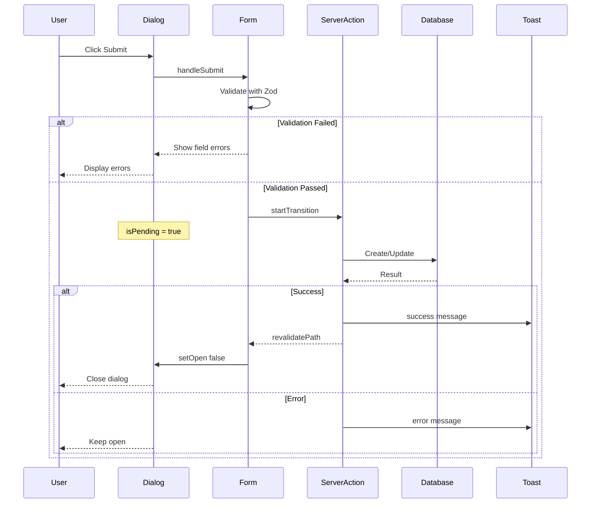

# CRUD Forms Implementation Plan

## Overview

This plan outlines the implementation of real forms for entity CRUD dialogs using:

- **Shadcn Field component** - Simplified form field composition
- **React Hook Form** - Form state management
- **Zod** - Schema validation (shared with server actions)
- **useTransition** - Non-blocking UI during server mutations
- **Next.js best practices** - Server actions, optimistic updates

## Current State Analysis

### Existing Dialog Components

All four dialogs follow the same pattern:

- Individual `useState` hooks for each field
- No validation beyond `disabled={!fieldName}`
- `handleSave` functions that only log data (not connected to server actions)
- No loading states or error handling

### Server Actions Status

Server actions are fully implemented with:

- Zod schemas already defined in each action file
- CRUD operations with proper revalidation
- Error handling with try/catch

### Dependencies (Already Installed)

```json
{
  "react-hook-form": "^7.54.1",
  "@hookform/resolvers": "^3.9.1",
  "zod": "^3.24.1",
  "sonner": "^1.7.1"
}
```

## Architecture Decision: Field vs Form Component

### Shadcn Field Component (Recommended)

The [`components/ui/field.tsx`](components/ui/field.tsx) provides a lighter-weight alternative to the full Form component:

**Pros:**

- Simpler composition without context overhead
- Better for dialogs with straightforward fields
- Works seamlessly with react-hook-form via `Controller`
- Less boilerplate code

**Approach (Controller-based pattern):**

```tsx
import { useForm, Controller } from "react-hook-form";
import { zodResolver } from "@hookform/resolvers/zod";
import {
  Field,
  FieldLabel,
  FieldError,
  FieldDescription,
} from "@/components/ui/field";
import { Input } from "@/components/ui/input";

function MyForm() {
  const {
    control,
    formState: { errors },
    handleSubmit,
  } = useForm({
    resolver: zodResolver(mySchema),
  });

  return (
    <Controller
      name="name"
      control={control}
      render={({ field, fieldState }) => (
        <Field invalid={fieldState.invalid}>
          <FieldLabel>Name</FieldLabel>
          <Input {...field} />
          <FieldError errors={[fieldState.error]} />
        </Field>
      )}
    />
  );
}
```

## Implementation Plan

### Phase 1: Shared Schema Module

Create a centralized schema module that can be imported by both server actions and client components.

**File:** `lib/validations/index.ts`

```typescript
// Re-export schemas for use in both server actions and client forms
export { projectSchema, type ProjectFormData } from "./project";
export { featureSchema, type FeatureFormData } from "./feature";
export { taskSchema, type TaskFormData } from "./task";
export { decisionSchema, type DecisionFormData } from "./decision";
```

**File:** `lib/validations/project.ts`

```typescript
import { z } from "zod";

export const projectSchema = z.object({
  name: z.string().min(1, "Name is required").max(255),
  description: z.string().default(""),
  status: z
    .enum(["Planning", "In Progress", "Launched", "Archived"])
    .optional(),
  techStack: z.array(z.string()).optional(),
});

// Input schema for the form (techStack as comma-separated string)
export const projectFormSchema = projectSchema.extend({
  techStack: z.string().optional(),
});

export type ProjectFormData = z.infer<typeof projectSchema>;
export type ProjectFormInput = z.infer<typeof projectFormSchema>;
```

### Phase 2: Form Dialog Pattern

Each dialog will follow this pattern using the Form component wrapper:

```tsx
"use client";

import { useForm, Controller } from "react-hook-form";
import { zodResolver } from "@hookform/resolvers/zod";
import { useTransition } from "react";
import { toast } from "sonner";
import { Form } from "@/components/ui/form";
import { Field, FieldLabel, FieldError } from "@/components/ui/field";
import { Input } from "@/components/ui/input";

interface EntityDialogProps {
  children: ReactNode;
  entity?: Entity; // For edit mode
  onSuccess?: (entity: Entity) => void;
  onClose?: () => void;
}

export function EntityDialog({
  children,
  entity,
  onSuccess,
}: EntityDialogProps) {
  const [isPending, startTransition] = useTransition();
  const [open, setOpen] = useState(false);

  const form = useForm<EntityFormInput>({
    resolver: zodResolver(entityFormSchema),
    defaultValues: entity ? { ...entity } : defaultValues,
  });

  function onSubmit(data: EntityFormInput) {
    startTransition(async () => {
      try {
        const result = entity
          ? await updateEntity(entity.id, transformData(data))
          : await createEntity(transformData(data));

        toast.success(entity ? "Entity updated" : "Entity created");
        setOpen(false);
        onSuccess?.(result);
      } catch (error) {
        toast.error("Something went wrong");
      }
    });
  }

  return (
    <Dialog open={open} onOpenChange={setOpen}>
      <DialogTrigger asChild>{children}</DialogTrigger>
      <DialogContent>
        <Form {...form}>
          <form onSubmit={form.handleSubmit(onSubmit)} className="space-y-4">
            <Controller
              name="name"
              control={form.control}
              render={({ field, fieldState }) => (
                <Field invalid={fieldState.invalid}>
                  <FieldLabel>Name</FieldLabel>
                  <Input {...field} />
                  <FieldError errors={[fieldState.error]} />
                </Field>
              )}
            />
            {/* Additional fields... */}
            <DialogFooter>
              <Button type="submit" disabled={isPending}>
                {isPending ? "Saving..." : "Save"}
              </Button>
            </DialogFooter>
          </form>
        </Form>
      </DialogContent>
    </Dialog>
  );
}
```

### Phase 3: Individual Dialog Implementations

#### 1. ProjectDialog

**Fields:**
| Field | Type | Validation |
|-------|------|------------|
| name | text | required, max 255 |
| description | textarea | optional |
| status | select | enum: Planning, In Progress, Launched, Archived |
| techStack | text | comma-separated, transformed to array |

**Special handling:**

- `techStack` input as comma-separated string, transformed to `string[]` before submit

#### 2. FeatureDialog

**Fields:**
| Field | Type | Validation |
|-------|------|------------|
| name | text | required, max 255 |
| description | textarea | optional |
| priority | select | enum: High, Medium, Low |
| status | select | enum: To Do, In Progress, Done |
| effortEstimate | text | optional |

**Additional props needed:**

- `projectId: string` - Required for create operation

#### 3. TaskDialog

**Fields:**
| Field | Type | Validation |
|-------|------|------------|
| title | text | required, max 255 |
| description | textarea | optional |
| status | select | enum: To Do, In Progress, Done |
| dueDate | date | optional |
| effortEstimate | text | optional |

**Additional props needed:**

- `featureId: string` - Required for create operation

#### 4. DecisionDialog

**Fields:**
| Field | Type | Validation |
|-------|------|------------|
| text | textarea | required |
| pros | textarea | optional, newline-separated |
| cons | textarea | optional, newline-separated |
| alternatives | textarea | optional |

**Special handling:**

- `pros` and `cons` as newline-separated strings, transformed to `string[]` before submit

**Additional props needed:**

- `featureId: string` - Required for create operation

### Phase 4: Toast Notifications

Use `sonner` (already installed) for toast notifications:

```tsx
import { toast } from "sonner";

// Success
toast.success("Project created successfully");

// Error
toast.error("Failed to create project");

// With action
toast.success("Project created", {
  action: {
    label: "View",
    onClick: () => router.push(`/projects/${project.id}`),
  },
});
```

### Phase 5: Loading States

Use `useTransition` for non-blocking UI:

```tsx
const [isPending, startTransition] = useTransition();

// In form
<Button type="submit" disabled={isPending}>
  {isPending && <Spinner className="mr-2" />}
  {isEdit ? "Save Changes" : "Create"}
</Button>;
```

## File Structure

```
lib/
  validations/
    index.ts          # Re-export all schemas
    project.ts        # Project schemas
    feature.ts        # Feature schemas
    task.ts           # Task schemas
    decision.ts       # Decision schemas

components/
  projects/
    project-dialog.tsx    # Refactored with react-hook-form
  features/
    feature-dialog.tsx    # Refactored with react-hook-form
  tasks/
    task-dialog.tsx       # Refactored with react-hook-form
  decisions/
    decision-dialog.tsx   # Refactored with react-hook-form
```

## Migration Steps

### Step 1: Create Validation Schemas

1. Create `lib/validations/` directory
2. Extract schemas from server actions into shared modules
3. Add form-specific schemas with input transformations

### Step 2: Update Server Actions

1. Import schemas from shared module
2. Keep existing logic, just change import source

### Step 3: Refactor Dialogs (One at a Time)

For each dialog:

1. Add react-hook-form with zodResolver
2. Replace individual useState with form.register
3. Add useTransition for async operations
4. Connect to server actions
5. Add toast notifications
6. Handle loading and error states

### Step 4: Testing

1. Test create operation
2. Test edit operation
3. Test validation errors
4. Test loading states
5. Test error handling

## Component API Design

### ProjectDialog

```tsx
interface ProjectDialogProps {
  children: ReactNode;
  project?: Project;           // For edit mode
  mode?: 'create' | 'edit';
  onSuccess?: (project: Project) => void;
}

// Usage
<ProjectDialog mode="create">
  <Button>New Project</Button>
</ProjectDialog>

<ProjectDialog project={project} mode="edit">
  <Button variant="ghost" size="icon"><Pencil /></Button>
</ProjectDialog>
```

### FeatureDialog

```tsx
interface FeatureDialogProps {
  children: ReactNode;
  feature?: Feature;
  projectId: string; // Required for create
  mode?: "create" | "edit";
  onSuccess?: (feature: Feature) => void;
}
```

### TaskDialog

```tsx
interface TaskDialogProps {
  children: ReactNode;
  task?: Task;
  featureId: string; // Required for create
  mode?: "create" | "edit";
  onSuccess?: (task: Task) => void;
}
```

### DecisionDialog

```tsx
interface DecisionDialogProps {
  children: ReactNode;
  decision?: Decision;
  featureId: string; // Required for create
  mode?: "create" | "edit";
  onSuccess?: (decision: Decision) => void;
}
```

## Error Handling Strategy

### Client-Side Validation

- Zod schemas provide immediate feedback
- Field-level error display using FieldError component

### Server-Side Errors

- Wrap server action calls in try/catch
- Display generic error toast for unexpected errors
- Handle specific error cases (e.g., "Feature not found")

### Form Reset on Success

- Call `form.reset()` after successful submission
- Close dialog automatically
- Optional: Navigate to new entity page

## Best Practices Applied

1. **Single Source of Truth** - Schemas shared between client and server
2. **Progressive Enhancement** - Works without JS (form submission)
3. **Accessibility** - Proper labels, error announcements
4. **UX** - Loading states, success/error feedback
5. **Type Safety** - Full TypeScript inference from schemas
6. **Separation of Concerns** - Validation separate from UI
7. **Non-Blocking UI** - useTransition keeps UI responsive

## Mermaid Diagram: Form Submission Flow



## Estimated Complexity

| Dialog         | Fields | Complexity | Notes                     |
| -------------- | ------ | ---------- | ------------------------- |
| ProjectDialog  | 4      | Medium     | Tech stack transformation |
| FeatureDialog  | 5      | Low        | Standard fields           |
| TaskDialog     | 5      | Medium     | Date input handling       |
| DecisionDialog | 4      | Medium     | Array transformations     |

## Next Steps

1. Review and approve this plan
2. Switch to Code mode for implementation
3. Implement validation schemas first
4. Refactor dialogs one at a time
5. Test each dialog after implementation
