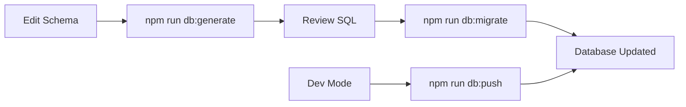
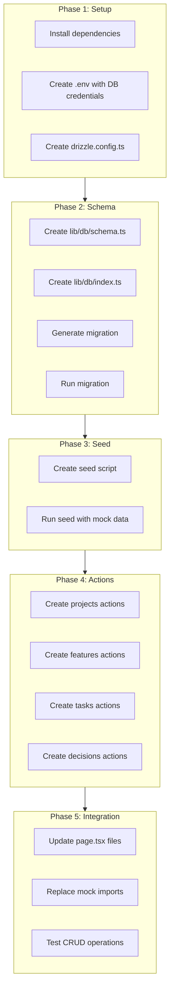

# Drizzle ORM 1.0+ with PostgreSQL Implementation Plan

## Overview

This plan outlines the implementation of Drizzle ORM with PostgreSQL for the project-tracker-app, replacing the current mock data system with persistent database storage.

## Current Architecture Analysis

### Existing Types (from `lib/mockData.ts`)

```typescript
// Entity Hierarchy
Project (1) ──► (N) Feature
Feature (1) ──► (N) Task
Feature (1) ──► (N) Decision

// Enums
Priority: 'High' | 'Medium' | 'Low'
ProjectStatus: 'Planning' | 'In Progress' | 'Launched' | 'Archived'
FeatureStatus: 'To Do' | 'In Progress' | 'Done'
TaskStatus: 'To Do' | 'In Progress' | 'Done'
```

---

## Phase 1: Dependencies and Configuration

### 1.1 Install Dependencies

```bash
npm i drizzle-orm pg
npm i -D drizzle-kit tsx @types/pg
```

**Package Purposes:**
| Package | Purpose |
|---------|---------|
| `drizzle-orm` | Core ORM with query builder |
| `pg` | PostgreSQL driver (node-postgres) |
| `drizzle-kit` | CLI for migrations and introspection |
| `tsx` | TypeScript execution for scripts |
| `@types/pg` | TypeScript types for pg |

### 1.2 Environment Variables (`.env`)

```env
# PostgreSQL Connection
DB_HOST=localhost
DB_PORT=5432
DB_USER=postgres
DB_PASSWORD=your_password
DB_NAME=project_tracker

# Constructed connection string
DATABASE_URL=postgresql://${DB_USER}:${DB_PASSWORD}@${DB_HOST}:${DB_PORT}/${DB_NAME}
```

### 1.3 Drizzle Config (`drizzle.config.ts`)

```typescript
import { defineConfig } from "drizzle-kit";

export default defineConfig({
  schema: "./lib/db/schema.ts",
  out: "./lib/db/migrations",
  dialect: "postgresql",
  dbCredentials: {
    url: process.env.DATABASE_URL!,
  },
  verbose: true,
  strict: true,
});
```

---

## Phase 2: Database Schema Design

### 2.1 Directory Structure

```
lib/
├── db/
│   ├── index.ts          # Connection and exports
│   ├── schema.ts         # All table definitions
│   └── migrations/       # Generated migration files
├── mockData.ts           # Keep for seeding/fallback
└── utils.ts
```

### 2.2 Schema Definition (`lib/db/schema.ts`)

```typescript
import {
  pgTable,
  text,
  timestamp,
  pgEnum,
  uuid,
  varchar,
  jsonb,
} from "drizzle-orm/pg-core";
import { relations } from "drizzle-orm";

// ═══════════════════════════════════════════════════════════════
// ENUMS
// ═══════════════════════════════════════════════════════════════

export const priorityEnum = pgEnum("priority", ["High", "Medium", "Low"]);
export const projectStatusEnum = pgEnum("project_status", [
  "Planning",
  "In Progress",
  "Launched",
  "Archived",
]);
export const featureStatusEnum = pgEnum("feature_status", [
  "To Do",
  "In Progress",
  "Done",
]);
export const taskStatusEnum = pgEnum("task_status", [
  "To Do",
  "In Progress",
  "Done",
]);

// ═══════════════════════════════════════════════════════════════
// TABLES
// ═══════════════════════════════════════════════════════════════

export const projects = pgTable("projects", {
  id: uuid("id").primaryKey().defaultRandom(),
  name: varchar("name", { length: 255 }).notNull(),
  description: text("description").notNull(),
  status: projectStatusEnum("status").default("Planning").notNull(),
  techStack: jsonb("tech_stack").$type<string[]>().default([]).notNull(),
  lastUpdated: timestamp("last_updated").defaultNow().notNull(),
  createdAt: timestamp("created_at").defaultNow().notNull(),
});

export const features = pgTable("features", {
  id: uuid("id").primaryKey().defaultRandom(),
  name: varchar("name", { length: 255 }).notNull(),
  description: text("description").notNull(),
  priority: priorityEnum("priority").default("Medium").notNull(),
  status: featureStatusEnum("status").default("To Do").notNull(),
  effortEstimate: varchar("effort_estimate", { length: 50 }),
  projectId: uuid("project_id")
    .references(() => projects.id, { onDelete: "cascade" })
    .notNull(),
  createdAt: timestamp("created_at").defaultNow().notNull(),
});

export const tasks = pgTable("tasks", {
  id: uuid("id").primaryKey().defaultRandom(),
  title: varchar("title", { length: 255 }).notNull(),
  description: text("description").notNull(),
  status: taskStatusEnum("status").default("To Do").notNull(),
  dueDate: timestamp("due_date"),
  effortEstimate: varchar("effort_estimate", { length: 50 }),
  featureId: uuid("feature_id")
    .references(() => features.id, { onDelete: "cascade" })
    .notNull(),
  createdAt: timestamp("created_at").defaultNow().notNull(),
});

export const decisions = pgTable("decisions", {
  id: uuid("id").primaryKey().defaultRandom(),
  date: timestamp("date").defaultNow().notNull(),
  text: text("text").notNull(),
  pros: jsonb("pros").$type<string[]>().default([]),
  cons: jsonb("cons").$type<string[]>().default([]),
  alternatives: text("alternatives"),
  featureId: uuid("feature_id")
    .references(() => features.id, { onDelete: "cascade" })
    .notNull(),
  createdAt: timestamp("created_at").defaultNow().notNull(),
});

// ═══════════════════════════════════════════════════════════════
// RELATIONS
// ═══════════════════════════════════════════════════════════════

export const projectsRelations = relations(projects, ({ many }) => ({
  features: many(features),
}));

export const featuresRelations = relations(features, ({ one, many }) => ({
  project: one(projects, {
    fields: [features.projectId],
    references: [projects.id],
  }),
  tasks: many(tasks),
  decisions: many(decisions),
}));

export const tasksRelations = relations(tasks, ({ one }) => ({
  feature: one(features, {
    fields: [tasks.featureId],
    references: [features.id],
  }),
}));

export const decisionsRelations = relations(decisions, ({ one }) => ({
  feature: one(features, {
    fields: [decisions.featureId],
    references: [features.id],
  }),
}));

// ═══════════════════════════════════════════════════════════════
// TYPE EXPORTS
// ═══════════════════════════════════════════════════════════════

export type Project = typeof projects.$inferSelect;
export type NewProject = typeof projects.$inferInsert;
export type Feature = typeof features.$inferSelect;
export type NewFeature = typeof features.$inferInsert;
export type Task = typeof tasks.$inferSelect;
export type NewTask = typeof tasks.$inferInsert;
export type Decision = typeof decisions.$inferSelect;
export type NewDecision = typeof decisions.$inferInsert;
```

### 2.3 Database Connection (`lib/db/index.ts`)

```typescript
import { drizzle } from "drizzle-orm/node-postgres";
import { Pool } from "pg";
import * as schema from "./schema";

const pool = new Pool({
  connectionString: process.env.DATABASE_URL,
});

export const db = drizzle(pool, { schema });

// Export schema for convenience
export * from "./schema";
```

---

## Phase 3: Migration Strategy

### 3.1 NPM Scripts (add to `package.json`)

```json
{
  "scripts": {
    "db:generate": "drizzle-kit generate",
    "db:migrate": "drizzle-kit migrate",
    "db:push": "drizzle-kit push",
    "db:studio": "drizzle-kit studio",
    "db:seed": "tsx lib/db/seed.ts"
  }
}
```

### 3.2 Migration Workflow



### 3.3 Seed Script (`lib/db/seed.ts`)

```typescript
import { db, projects, features, tasks, decisions } from "./index";
import { mockProjects, mockDecisions } from "../mockData";

async function seed() {
  console.log("Seeding database...");

  // Insert projects with nested data
  for (const project of mockProjects) {
    const [insertedProject] = await db
      .insert(projects)
      .values({
        id: project.id,
        name: project.name,
        description: project.description,
        status: project.status,
        techStack: project.techStack,
        lastUpdated: new Date(project.lastUpdated),
      })
      .returning();

    // Insert features
    for (const feature of project.features) {
      await db.insert(features).values({
        id: feature.id,
        name: feature.name,
        description: feature.description,
        priority: feature.priority,
        status: feature.status,
        effortEstimate: feature.effortEstimate,
        projectId: insertedProject.id,
      });

      // Insert tasks
      for (const task of feature.tasks) {
        await db.insert(tasks).values({
          id: task.id,
          title: task.title,
          description: task.description,
          status: task.status,
          dueDate: task.dueDate ? new Date(task.dueDate) : null,
          effortEstimate: task.effortEstimate,
          featureId: feature.id,
        });
      }
    }
  }

  // Insert decisions
  for (const decision of mockDecisions) {
    await db.insert(decisions).values({
      id: decision.id,
      date: new Date(decision.date),
      text: decision.text,
      pros: decision.pros,
      cons: decision.cons,
      alternatives: decision.alternatives,
      featureId: decision.featureId,
    });
  }

  console.log("Seeding complete!");
}

seed().catch(console.error);
```

---

## Phase 4: Server Actions Architecture

### 4.1 Directory Structure

```
app/
├── actions/
│   ├── projects.ts      # Project CRUD
│   ├── features.ts      # Feature CRUD
│   ├── tasks.ts         # Task CRUD
│   └── decisions.ts     # Decision CRUD
```

### 4.2 Server Actions Pattern

Each entity follows this pattern:

```typescript
// app/actions/projects.ts
"use server";

import { db, projects, features, tasks, decisions } from "@/lib/db";
import { eq } from "drizzle-orm";
import { revalidatePath } from "next/cache";
import { z } from "zod";

// ═══════════════════════════════════════════════════════════════
// SCHEMAS
// ═══════════════════════════════════════════════════════════════

const projectSchema = z.object({
  name: z.string().min(1).max(255),
  description: z.string(),
  status: z
    .enum(["Planning", "In Progress", "Launched", "Archived"])
    .optional(),
  techStack: z.array(z.string()).optional(),
});

// ═══════════════════════════════════════════════════════════════
// READ OPERATIONS
// ═══════════════════════════════════════════════════════════════

export async function getProjects() {
  return db.query.projects.findMany({
    with: {
      features: {
        with: {
          tasks: true,
          decisions: true,
        },
      },
    },
    orderBy: (projects, { desc }) => [desc(projects.lastUpdated)],
  });
}

export async function getProjectById(id: string) {
  return db.query.projects.findFirst({
    where: eq(projects.id, id),
    with: {
      features: {
        with: {
          tasks: true,
          decisions: true,
        },
      },
    },
  });
}

// ═══════════════════════════════════════════════════════════════
// WRITE OPERATIONS
// ═══════════════════════════════════════════════════════════════

export async function createProject(data: z.infer<typeof projectSchema>) {
  const validated = projectSchema.parse(data);

  const [project] = await db
    .insert(projects)
    .values({
      ...validated,
      status: validated.status ?? "Planning",
      techStack: validated.techStack ?? [],
    })
    .returning();

  revalidatePath("/projects");
  return project;
}

export async function updateProject(
  id: string,
  data: Partial<z.infer<typeof projectSchema>>,
) {
  const [project] = await db
    .update(projects)
    .set({
      ...data,
      lastUpdated: new Date(),
    })
    .where(eq(projects.id, id))
    .returning();

  revalidatePath("/projects");
  revalidatePath(`/projects/${id}`);
  return project;
}

export async function deleteProject(id: string) {
  await db.delete(projects).where(eq(projects.id, id));
  revalidatePath("/projects");
}
```

### 4.3 Complete CRUD Operations Matrix

| Entity   | Create             | Read                                  | Update             | Delete             |
| -------- | ------------------ | ------------------------------------- | ------------------ | ------------------ |
| Project  | `createProject()`  | `getProjects()`, `getProjectById()`   | `updateProject()`  | `deleteProject()`  |
| Feature  | `createFeature()`  | `getFeatures()`, `getFeatureById()`   | `updateFeature()`  | `deleteFeature()`  |
| Task     | `createTask()`     | `getTasks()`, `getTaskById()`         | `updateTask()`     | `deleteTask()`     |
| Decision | `createDecision()` | `getDecisions()`, `getDecisionById()` | `updateDecision()` | `deleteDecision()` |

---

## Phase 5: Implementation Order



---

## Key Decisions

### Why UUID over Integer IDs?

- Matches existing mock data format
- Better for distributed systems
- No auto-increment gaps on deletion
- Safe for URL exposure

### Why `onDelete: cascade`?

- Deleting a project should remove all features
- Deleting a feature should remove all tasks and decisions
- Prevents orphaned records

### Why Server Actions over API Routes?

- Next.js 15+ recommended pattern
- Type-safe with TypeScript
- Automatic revalidation with `revalidatePath()`
- Simpler than tRPC for this MVP scope

---

## Testing Strategy (Post-Implementation)

Once Drizzle is integrated, tests should cover:

1. **Schema Tests**: Verify table creation and constraints
2. **CRUD Tests**: Each server action with valid/invalid inputs
3. **Relation Tests**: Verify cascade deletes work correctly
4. **Migration Tests**: Verify migrations are idempotent

---

## Files to Create/Modify

| File                       | Action | Purpose            |
| -------------------------- | ------ | ------------------ |
| `lib/db/schema.ts`         | Create | Table definitions  |
| `lib/db/index.ts`          | Create | Connection export  |
| `lib/db/seed.ts`           | Create | Mock data seeder   |
| `drizzle.config.ts`        | Create | Drizzle Kit config |
| `.env`                     | Modify | Add DATABASE_URL   |
| `package.json`             | Modify | Add DB scripts     |
| `app/actions/projects.ts`  | Create | Project CRUD       |
| `app/actions/features.ts`  | Create | Feature CRUD       |
| `app/actions/tasks.ts`     | Create | Task CRUD          |
| `app/actions/decisions.ts` | Create | Decision CRUD      |
