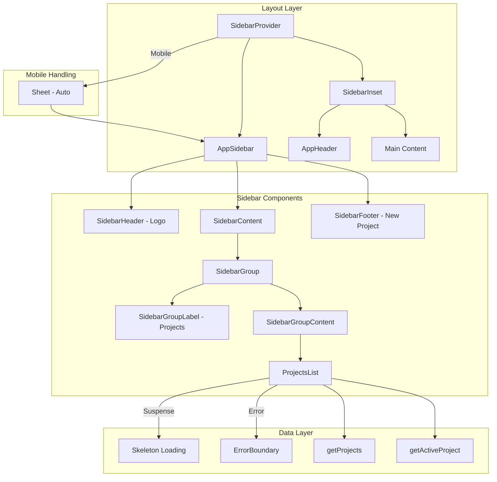

# Sidebar Refactoring Plan: Migrate to shadcn/ui Sidebar

## Executive Summary

This plan outlines the refactoring of the current custom sidebar implementation to use the shadcn/ui Sidebar component. The shadcn sidebar provides a more robust, feature-rich solution with built-in mobile support, cookie persistence, keyboard shortcuts, and proper accessibility.

## Current Architecture Analysis

### Existing Components

| File                                             | Purpose                                | Lines |
| ------------------------------------------------ | -------------------------------------- | ----- |
| `contexts/sidebar-context.tsx`                   | Custom context for sidebar state       | 34    |
| `components/_sidebar-client.tsx`                 | Client component for sidebar rendering | 45    |
| `components/app-sidebar.tsx`                     | Main sidebar composition               | 65    |
| `components/mobile-sidebar.tsx`                  | Mobile-specific sidebar with Sheet     | 25    |
| `components/app-header.tsx`                      | Header with sidebar toggle             | 45    |
| `components/projects/project-sidebar-item.tsx`   | Project menu item                      | 41    |
| `components/loading/sidebar-loading.tsx`         | Loading skeleton                       | 22    |
| `components/projects/sidebar-projects-empty.tsx` | Empty state                            | 31    |
| `components/projects/sidebar-projects-error.tsx` | Error state                            | 28    |
| `components/error-boundary.tsx`                  | Error boundary                         | 38    |

### Current Issues

1. **Duplicate Context**: Custom `SidebarProvider` duplicates functionality already in shadcn
2. **Manual Mobile Handling**: Separate `MobileSidebar` component required
3. **No Cookie Persistence**: Sidebar state resets on page reload
4. **No Keyboard Shortcuts**: Missing Ctrl+B toggle functionality
5. **Inconsistent Styling**: Custom CSS classes instead of design system

## Target Architecture

### Component Mapping

```
Current                          →  Target
─────────────────────────────────────────────────────
contexts/sidebar-context.tsx     →  DELETE - use shadcn SidebarProvider
components/_sidebar-client.tsx   →  DELETE - merge into app-sidebar.tsx
components/mobile-sidebar.tsx    →  DELETE - shadcn handles mobile
components/app-sidebar.tsx       →  REFACTOR - use shadcn components
components/app-header.tsx        →  REFACTOR - use SidebarTrigger
```

### shadcn Components to Use

| Component             | Usage                               |
| --------------------- | ----------------------------------- |
| `SidebarProvider`     | Wraps app, provides context         |
| `Sidebar`             | Main sidebar container              |
| `SidebarHeader`       | Logo/branding area                  |
| `SidebarContent`      | Scrollable content area             |
| `SidebarFooter`       | Bottom actions - New Project button |
| `SidebarGroup`        | Projects section grouping           |
| `SidebarGroupLabel`   | "Projects" label                    |
| `SidebarGroupContent` | Projects list container             |
| `SidebarMenu`         | Menu list                           |
| `SidebarMenuItem`     | Individual menu item wrapper        |
| `SidebarMenuButton`   | Clickable menu button               |
| `SidebarMenuSkeleton` | Loading state                       |
| `SidebarTrigger`      | Toggle button for header            |
| `SidebarInset`        | Main content wrapper                |
| `SidebarRail`         | Optional drag handle                |

## Implementation Steps

### Phase 1: Foundation Changes

#### Step 1.1: Update Layout Structure

**File**: `app/layout.tsx`

Replace custom `SidebarProvider` with shadcn's version:

```tsx
import { SidebarProvider, SidebarInset } from "@/components/ui/sidebar";
import { AppSidebar } from "@/components/app-sidebar";
import { AppHeader } from "@/components/app-header";

export default function RootLayout({ children }) {
  return (
    <html lang="en">
      <body>
        <SidebarProvider>
          <AppSidebar />
          <SidebarInset>
            <AppHeader />
            <main>{children}</main>
          </SidebarInset>
        </SidebarProvider>
      </body>
    </html>
  );
}
```

#### Step 1.2: Delete Obsolete Files

- [ ] Delete `contexts/sidebar-context.tsx`
- [ ] Delete `components/_sidebar-client.tsx`
- [ ] Delete `components/mobile-sidebar.tsx`

### Phase 2: Refactor App Sidebar

#### Step 2.1: Create New AppSidebar Component

**File**: `components/app-sidebar.tsx`

```tsx
import { Suspense } from "react";
import {
  Sidebar,
  SidebarHeader,
  SidebarContent,
  SidebarFooter,
  SidebarGroup,
  SidebarGroupLabel,
  SidebarGroupContent,
  SidebarMenu,
  SidebarMenuSkeleton,
} from "@/components/ui/sidebar";
import { FolderKanban, Plus } from "lucide-react";
import Link from "next/link";
import { Button } from "@/components/ui/button";
import { ProjectDialog } from "@/components/projects/project-dialog";
import { ProjectSidebarItem } from "@/components/projects/project-sidebar-item";
import { SidebarProjectsEmpty } from "@/components/projects/sidebar-projects-empty";
import { SidebarErrorBoundary } from "@/components/error-boundary";
import { getProjects, getActiveProject } from "@/lib/queries";

export function AppSidebar() {
  return (
    <Sidebar collapsible="icon">
      {/* Header - Logo */}
      <SidebarHeader>
        <SidebarMenu>
          <SidebarMenuItem>
            <SidebarMenuButton size="lg" asChild>
              <Link href="/">
                <FolderKanban className="h-6 w-6" />
                <span>Dev Tracker</span>
              </Link>
            </SidebarMenuButton>
          </SidebarMenuItem>
        </SidebarMenu>
      </SidebarHeader>

      {/* Content - Projects List */}
      <SidebarContent>
        <SidebarGroup>
          <SidebarGroupLabel>Projects</SidebarGroupLabel>
          <SidebarGroupContent>
            <SidebarErrorBoundary>
              <Suspense fallback={<ProjectsLoadingSkeleton />}>
                <ProjectsList />
              </Suspense>
            </SidebarErrorBoundary>
          </SidebarGroupContent>
        </SidebarGroup>
      </SidebarContent>

      {/* Footer - New Project Button */}
      <SidebarFooter>
        <ProjectDialog>
          <Button size="sm" className="w-full">
            <Plus className="mr-2 h-4 w-4" />
            New Project
          </Button>
        </ProjectDialog>
      </SidebarFooter>
    </Sidebar>
  );
}

function ProjectsLoadingSkeleton() {
  return (
    <SidebarMenu>
      {[1, 2, 3, 4].map((i) => (
        <SidebarMenuItem key={i}>
          <SidebarMenuSkeleton showIcon />
        </SidebarMenuItem>
      ))}
    </SidebarMenu>
  );
}

async function ProjectsList() {
  const [projects, activeProject] = await Promise.all([
    getProjects(),
    getActiveProject(),
  ]);

  if (projects.length === 0) {
    return <SidebarProjectsEmpty />;
  }

  return (
    <SidebarMenu>
      {projects.map((project) => (
        <ProjectSidebarItem
          key={project.id}
          project={project}
          isActive={project.id === activeProject?.id}
        />
      ))}
    </SidebarMenu>
  );
}
```

#### Step 2.2: Update ProjectSidebarItem

**File**: `components/projects/project-sidebar-item.tsx`

```tsx
"use client";

import { Project } from "@/lib/db";
import { SidebarMenuButton, SidebarMenuItem } from "@/components/ui/sidebar";
import { usePathname } from "next/navigation";

interface Props {
  project: Pick<Project, "id" | "name" | "status">;
  isActive?: boolean;
}

export function ProjectSidebarItem({ project, isActive }: Props) {
  const pathname = usePathname();
  const isCurrentRoute = pathname.startsWith(`/projects/${project.id}`);

  return (
    <SidebarMenuItem>
      <SidebarMenuButton
        asChild
        isActive={isCurrentRoute}
        tooltip={project.name}
      >
        <a href={`/projects/${project.id}`}>
          <StatusIndicator status={project.status} />
          <span>{project.name}</span>
        </a>
      </SidebarMenuButton>
    </SidebarMenuItem>
  );
}

function StatusIndicator({ status }: { status: string }) {
  const colorClass =
    {
      "In Progress": "bg-blue-500",
      Planning: "bg-yellow-500",
      Launched: "bg-green-500",
      Archived: "bg-gray-500",
    }[status] ?? "bg-gray-500";

  return <div className={`h-2 w-2 rounded-full ${colorClass}`} />;
}
```

### Phase 3: Update Header

#### Step 3.1: Refactor AppHeader

**File**: `components/app-header.tsx`

```tsx
"use client";

import { Search } from "lucide-react";
import { SidebarTrigger } from "@/components/ui/sidebar";
import { Input } from "@/components/ui/input";
import { AppBreadcrumb } from "./app-breadcrumb";

export function AppHeader() {
  return (
    <header className="sticky top-0 z-10 border-b border-border bg-background/95 backdrop-blur">
      <div className="flex h-16 items-center gap-4 px-6">
        <SidebarTrigger />
        <AppBreadcrumb />
        <div className="flex-1">
          <div className="relative w-full max-w-md">
            <Search className="absolute left-3 top-1/2 h-4 w-4 -translate-y-1/2 text-muted-foreground" />
            <Input
              type="search"
              placeholder="Search projects, features, tasks..."
              className="pl-9"
            />
          </div>
        </div>
      </div>
    </header>
  );
}
```

### Phase 4: Update Empty and Error States

#### Step 4.1: Update Empty State

**File**: `components/projects/sidebar-projects-empty.tsx`

```tsx
import { FolderOpen } from "lucide-react";
import { SidebarGroupLabel } from "@/components/ui/sidebar";

export function SidebarProjectsEmpty() {
  return (
    <div className="flex flex-col items-center justify-center py-6 text-center">
      <FolderOpen className="mb-2 h-8 w-8 text-muted-foreground/50" />
      <p className="text-xs text-muted-foreground">No projects yet</p>
      <p className="text-xs text-muted-foreground/70">
        Create your first project below
      </p>
    </div>
  );
}
```

#### Step 4.2: Update Error State

**File**: `components/projects/sidebar-projects-error.tsx`

```tsx
import { AlertCircle } from "lucide-react";

export function SidebarProjectsError({
  message = "Failed to load projects",
}: {
  message?: string;
}) {
  return (
    <div className="flex flex-col items-center justify-center py-6 text-center">
      <AlertCircle className="mb-2 h-8 w-8 text-destructive/70" />
      <p className="text-xs text-muted-foreground">{message}</p>
    </div>
  );
}
```

### Phase 5: Data Layer Refactoring

#### Step 5.1: Create Query Functions

**File**: `lib/queries/projects.ts` (new file)

```tsx
import { cacheTag } from "next/cache";
import { db, projects } from "@/lib/db";
import { desc, eq } from "drizzle-orm";

export async function getProjects() {
  "use cache";
  cacheTag("projects");

  return db.query.projects.findMany({
    columns: { id: true, name: true, status: true },
  });
}

export async function getActiveProject() {
  return db.query.projects.findFirst({
    where: eq(projects.status, "In Progress"),
    columns: { id: true },
    orderBy: desc(projects.lastUpdated),
  });
}
```

## Architecture Diagram



## Benefits of Refactoring

| Feature            | Before                 | After                             |
| ------------------ | ---------------------- | --------------------------------- |
| Mobile Support     | Manual Sheet component | Built-in with responsive behavior |
| State Persistence  | None                   | Cookie-based persistence          |
| Keyboard Shortcuts | None                   | Ctrl+B toggle                     |
| Accessibility      | Basic                  | Full ARIA support                 |
| Collapsible        | Width-based CSS        | Icon mode with tooltips           |
| Code Complexity    | 10 files               | 6 files                           |

## File Changes Summary

### Files to Delete

- `contexts/sidebar-context.tsx`
- `components/_sidebar-client.tsx`
- `components/mobile-sidebar.tsx`
- `components/loading/sidebar-loading.tsx` (use shadcn skeleton)

### Files to Modify

- `app/layout.tsx` - Use shadcn SidebarProvider
- `components/app-sidebar.tsx` - Complete refactor
- `components/app-header.tsx` - Use SidebarTrigger
- `components/projects/project-sidebar-item.tsx` - Use shadcn components
- `components/projects/sidebar-projects-empty.tsx` - Minor updates
- `components/projects/sidebar-projects-error.tsx` - Minor updates

### Files to Create

- `lib/queries/projects.ts` - Extracted query functions

## Testing Checklist

- [ ] Desktop sidebar renders correctly
- [ ] Mobile sidebar opens/closes via Sheet
- [ ] Sidebar toggle button works in header
- [ ] Ctrl+B keyboard shortcut toggles sidebar
- [ ] Sidebar state persists across page reloads
- [ ] Loading skeleton displays while fetching
- [ ] Empty state displays when no projects
- [ ] Error boundary catches and displays errors
- [ ] Active project indicator works
- [ ] Project navigation works correctly
- [ ] New Project button in footer works
- [ ] Icon collapse mode shows tooltips
- [ ] Breadcrumbs still function correctly

## Risk Assessment

| Risk                         | Likelihood | Impact | Mitigation                      |
| ---------------------------- | ---------- | ------ | ------------------------------- |
| Breaking existing navigation | Low        | High   | Test all routes after refactor  |
| Mobile layout issues         | Medium     | Medium | Test on multiple screen sizes   |
| Context provider conflicts   | Low        | High   | Ensure only one SidebarProvider |
| CSS conflicts                | Low        | Low    | Use shadcn CSS variables        |

## Rollback Plan

If issues arise, revert to previous implementation:

1. Restore deleted files from git
2. Revert `app/layout.tsx` to use custom `SidebarProvider`
3. Revert `app-sidebar.tsx` to previous implementation
